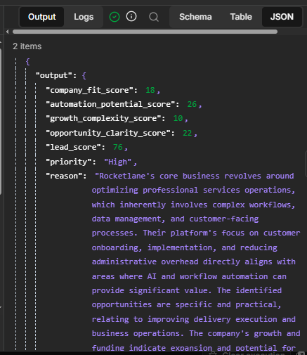
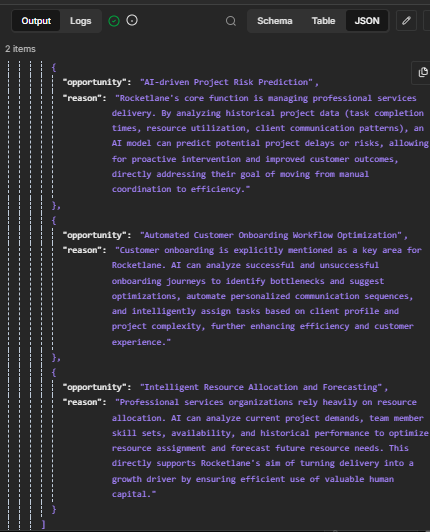
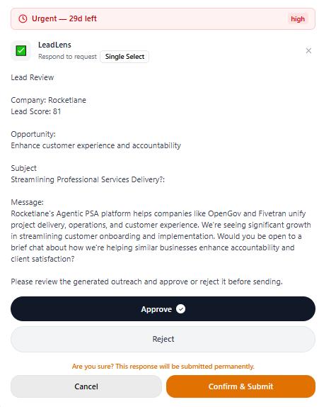

# LeadLens

### AI-Powered Lead Research & Outreach Automation

LeadLens is an AI-powered workflow built with **n8n** that automates company research, lead qualification, opportunity identification, and personalized outreach.

It turns a list of companies into structured, qualified leads with actionable business opportunities — while keeping a human in the loop before outreach is sent.

---

## 🚀 What It Does

LeadLens takes company information from Google Sheets and processes each company through an automated research and qualification workflow.

The workflow:

1. **Collects company data** from Google Sheets
2. **Researches companies** using web search and external APIs
3. **Analyzes company information** with an LLM
4. **Identifies potential AI and automation opportunities**
5. **Scores leads** across multiple criteria
6. **Filters qualified leads** based on the lead score
7. **Generates personalized outreach**
8. **Saves the generated outreach** to the lead record
9. **Requests human approval** before sending
10. **Sends approved outreach** through Gmail
11. **Updates lead status** based on the workflow outcome

---

## 🧠 Lead Scoring

LeadLens uses a multi-dimensional scoring approach rather than relying on a single AI-generated judgment.

Each lead is evaluated across:

- **Company Fit**
- **Automation Potential**
- **Growth & Complexity**
- **Opportunity Clarity**

These factors are combined into an overall **Lead Score** used to determine which leads move forward to outreach.

The scoring process is designed to prioritize companies where there is both a reasonable business fit and a concrete, relevant automation opportunity.



---

## 🔍 Opportunity Identification

LeadLens does more than determine whether a company is a potential lead.

It also identifies **specific business opportunities** where AI or automation could potentially provide value, based on the available company research.

Examples include:

- AI-powered Lead Qualification
- Customer Support Automation
- Workflow Automation
- Data Processing
- Research Automation
- Project Risk Prediction

Each opportunity includes a concise explanation of why it is relevant to the company.

The identified opportunity is then used as the basis for personalized outreach.



---

## ✉️ Personalized Outreach

For qualified leads, LeadLens generates personalized outreach based on the company's research and identified opportunity.

The generated outreach includes:

- **Email subject**
- **Personalized message**
- **Opportunity used as the basis for the message**

The outreach is generated only after the lead passes the qualification stage.

---

## 👤 Human-in-the-Loop

LeadLens does not automatically send AI-generated outreach immediately.

Before an email is sent, a **Human-in-the-Loop approval step** allows a user to review the lead and generated outreach.

The user can:

- **Approve** the outreach and continue to email delivery
- **Reject** the outreach and stop the sending process

This adds a human control layer between AI-generated content and external communication.



---

## 🏗️ Workflow Architecture


```text
Google Sheets
      │
      ▼
Company Research
      │
      ▼
AI Company Analysis
      │
      ▼
Opportunity Identification
      │
      ▼
Lead Scoring
      │
      ▼
Qualification Gate
      │
      ▼
Outreach Generation
      │
      ▼
Save Outreach
      │
      ▼
Human Approval
      │
      ├── Reject ──→ Status: Rejected
      │
      └── Approve
             │
             ▼
          Gmail
             │
             ▼
         Status: Sent
